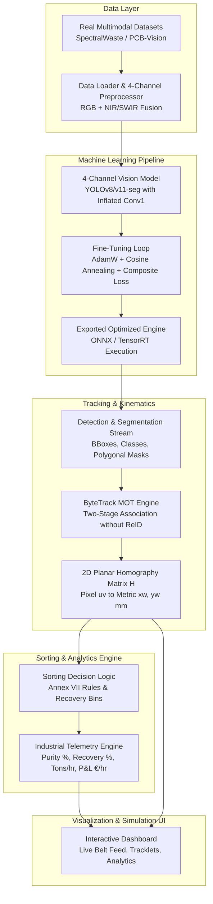

# Project Implementation Plan: Adaptive Multi-Modal AI E-Waste Sorting Simulation

## 1. Project Overview & Scope

### 1.1 Objective
Build an end-to-end, real-time software digital twin simulation of an industrial optical sorting system for Waste Electrical and Electronic Equipment (WEEE). The system uses **real multimodal datasets** and **pretrained vision models** adapted via **4-channel tensor inflation** to categorize, segment, track, and sort e-waste fragments at industrial line speeds ($1.0\text{–}4.0\text{ m/s}$).

### 1.2 In-Scope Deliverables
1. **Multimodal Dataset Pipeline**: Ingestion and preprocessing of real benchmark data (RGB + NIR/SWIR or HSI), formatted as 4-channel tensors ($B \times 4 \times H \times W$).
2. **4-Channel AI Model & Finetuning**: Pretrained vision segmentation backbone (e.g., YOLO-seg) adapted via non-destructive Conv1 weight inflation and finetuned with composite loss ($\mathcal{L}_{\text{CIoU}} + \mathcal{L}_{\text{DFL}} + \mathcal{L}_{\text{BCE}} + \mathcal{L}_{\text{Dice}}$).
3. **Tracking & Kinematics Engine**: ReID-free ByteTrack integration coupled with 2D planar homography ($H$) mapping pixel coordinates to metric conveyor space.
4. **Sorting Decision Engine**: Material classification and automated bin assignment adhering to EU WEEE Directive Annex VII de-pollution and India CPCB EPR regulations.
5. **Interactive Dashboard & Telemetry**: High-performance visual UI showing live conveyor belt feed, segmentation masks, persistent tracklet IDs, material recovery/purity KPIs, throughput, and economic yield (€/hr).

### 1.3 Out-of-Scope (Excluded by Design)
- Physical IoT/PLC hardware interfaces and physical solenoid valve wiring.
- 64-nozzle physical air-jet manifold visualizer graphic.

---

## 2. System Architecture

---

## 3. Detailed Phase Breakdown

### Phase 1: Environment & Project Foundation
- **Tasks**:
  - Establish modular directory structure (`src/data`, `src/models`, `src/tracking`, `src/simulation`, `src/ui`).
  - Configure dependencies: PyTorch, Torchvision, OpenCV, Ultralytics/YOLO, NumPy, Pandas, FastAPI / WebSocket or Streamlit / Next.js for the UI dashboard.
  - Setup unified configuration system (`configs/system_config.yaml`) for conveyor speed, camera parameters, homography matrices, and material taxonomy.
- **Milestone**: Project boilerplate initialized, configuration verified.

---

### Phase 2: Multimodal Real Dataset Ingestion & Preprocessing
- **Tasks**:
  - Download and parse benchmark dataset (e.g., **SpectralWaste** or **PCB-Vision**).
  - Implement 4-channel tensor builder combining spatial RGB ($3\text{ ch}$) and spectral NIR/SWIR ($1\text{ ch}$).
  - Implement data augmentation pipeline (motion blur aligned to belt movement $1.0\text{–}4.0\text{ m/s}$, specular glare injection, industrial dust masking, CutOut).
  - Format dataset annotations into standard polygon segmentation format for target categories (High-Grade PCBs, IC Molds/Chips, Battery Units, BFR Polymers, Heat Sinks, Wire Harnesses).
- **Milestone**: Fully functional PyTorch `Dataset` and `DataLoader` yielding normalized `(B, 4, H, W)` tensors with ground-truth masks.

---

### Phase 3: 4-Channel Model Architecture & Fine-Tuning
- **Tasks**:
  - Implement **Weight Inflation**: Take pretrained weights (e.g. YOLOv8/v11-seg), expand `Conv1` from 3 input channels to 4 channels, initializing channel 4 with the channel-wise mean of RGB to preserve learned feature magnitude.
  - Formulate composite loss:
    $$\mathcal{L}_{\text{total}} = \lambda_{\text{box}}\mathcal{L}_{\text{CIoU}} + \lambda_{\text{dfl}}\mathcal{L}_{\text{DFL}} + \lambda_{\text{cls}}\mathcal{L}_{\text{BCE}} + \lambda_{\text{mask}}\mathcal{L}_{\text{Dice}}$$
  - Build two-stage training loop:
    - *Stage 1*: Backbone frozen (10 epochs), train inflated layer and heads.
    - *Stage 2*: Full unfreeze (100 epochs) with Cosine Annealing learning rate schedule ($\eta_{\text{max}} = 10^{-4}, \eta_{\text{min}} = 10^{-6}$).
  - Benchmark validation mAP and mIoU metrics; export trained model checkpoint.
- **Milestone**: Validated, fine-tuned 4-channel segmentation model capable of high-accuracy inference.

---

### Phase 4: High-Speed Tracking & Kinematics Engine
- **Tasks**:
  - Integrate **ByteTrack** multi-object tracker:
    - Stage 1 association: High-confidence detections ($\text{score} \ge 0.5$) with Kalman filters.
    - Stage 2 association: Low-confidence detections ($0.1 \le \text{score} < 0.5$) to recover motion-blurred or partially occluded fragments.
  - Integrate **2D Planar Homography ($H$)**:
    - Direct Linear Transform (DLT) mapping image plane coordinates $(u, v)$ to real conveyor metric surface $(x_w, y_w)$ in millimeters.
  - Implement trajectory projection matching conveyor travel speed $v_{\text{belt}} \cdot \Delta t$.
- **Milestone**: Stable, persistent tracklet IDs assigned across successive frames with accurate millimeter coordinates.

---

### Phase 5: Sorting Decision Engine & Industrial Telemetry
- **Tasks**:
  - Implement sorting allocation rules based on taxonomy:
    - Hazardous extraction: Battery units and BFR polymers (Annex VII de-pollution).
    - High-value recovery: High-Grade PCBs and IC Molds.
    - Secondary metals: Heat sinks and copper wire harnesses.
  - Calculate real-time industrial KPIs:
    - **Recovery Rate (%)** and **Purity (%)** per collection bin.
    - **Throughput Rate** ($\text{tons/hour}$ or $\text{kg/hour}$).
    - **Economic Yield (€/hr)** based on market values (€15–€45/kg for PCBs, €50–€180/kg for ICs, etc.) minus penalty deductions.
    - **End-to-End Latency** (ms per frame, target $<20\text{ ms}$ for $\ge 50\text{ FPS}$).
- **Milestone**: Sorting logic categorizes all tracked items into destination bins with live telemetry calculation.

---

### Phase 6: Interactive Dashboard & Simulation Interface
- **Tasks**:
  - Build an interactive UI:
    - **Live Conveyor View**: Video stream with bounding boxes, segmentation masks, material labels, and ByteTrack tracklet IDs.
    - **Simulation Controls**: Conveyor speed slider ($1.0\text{ to }4.0\text{ m/s}$), stream pause/play, confidence threshold slider.
    - **Analytics Panel**: Real-time charts for purity, recovery rate, mass throughput, economic yield, and latency.
    - **Inspection Log**: Table of recently sorted items with classification confidence, surface area ($\text{cm}^2$), and target bin.
  - Optimize pipeline for smooth 50+ FPS real-time playback.
- **Milestone**: Complete, polished interactive simulation application ready for demonstration and evaluation.

---

## 4. Technology Stack

| Layer | Component | Selection |
|---|---|---|
| **Language** | Core Runtime | Python 3.12 |
| **Deep Learning** | Framework & Vision Models | PyTorch, Torchvision, Ultralytics / Timm |
| **Image Processing** | Augmentation & Transforms | OpenCV, Albumentations, NumPy |
| **Tracking** | Multi-Object Tracking | ByteTrack (Kalman Filter + 2-Stage Hungarian Association) |
| **Data Format** | Multimodal Tensors | 4-Channel NumPy / PyTorch Tensors (`.npy`, `.pt`, or TIFF) |
| **Frontend UI** | Dashboard & Visualization | Modern Web UI / Streamlit / FastAPI + WebSocket Dashboard |
| **Configuration** | System & Physics Parameters | YAML (`PyYAML`) |

---

## 5. Execution Timeline & Next Actions

1. [x] **Project Scoping & Architectural Planning** (Completed in `docs/project_plan/IMPLEMENTATION_PLAN.md`)
2. [x] **Phase 1: Project Foundation & Configuration Setup** (Directory scaffolding, `system_config.yaml`, config loader, core modules)
3. [x] **Phase 2: Real Multimodal Dataset Ingestion & 4-Channel DataLoader** (Real SpectralWaste triplets, industrial conveyor augmentations, 4-ch tensor builder)
4. [x] **Phase 3: 4-Channel Model Architecture & Fine-Tuning** (Conv1 weight inflation, DeepLabV3 multimodal backbone, Composite CE+Dice loss, 2-stage fine-tuning & inference engine)
5. [x] **Phase 4: ByteTrack Multi-Object Tracking & Conveyor Kinematics Engine** (Conveyor Kalman filter, 2-stage ByteTrack association, dynamic metric trajectory projection)
6. [x] **Phase 5: Advanced Sorting Decision Engine & Digital Twin Simulation** (Annex VII mandatory de-pollution thresholds, CPCB EPR penalties, energy & PnL accounting, end-to-end simulator)
7. [x] **Phase 6: High-Performance Interactive UI Simulation Dashboard** (Glassmorphism dark UI, live WebSocket streaming, speed & confidence sliders, drag-and-drop media upload, itemized inspection feed)
